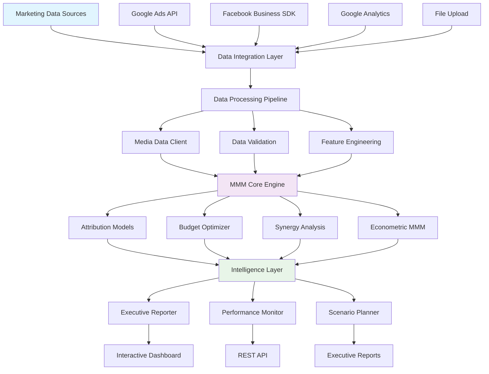
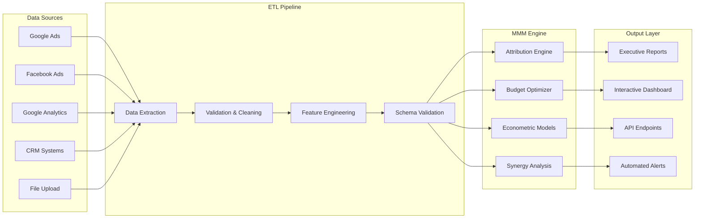
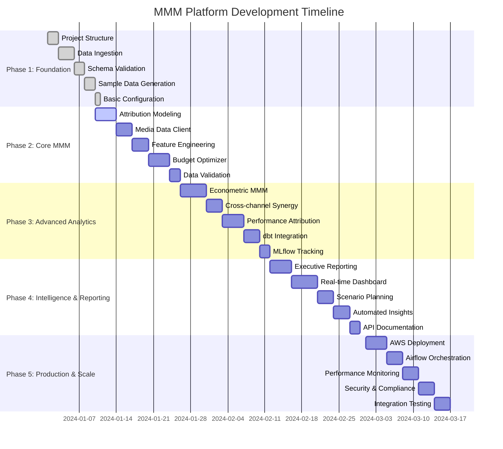
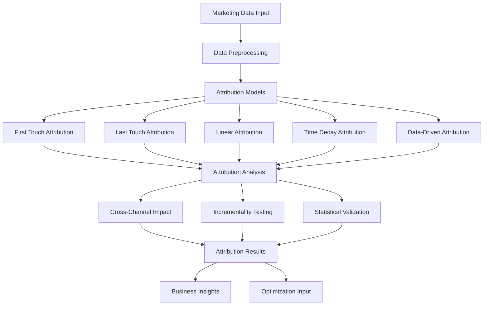
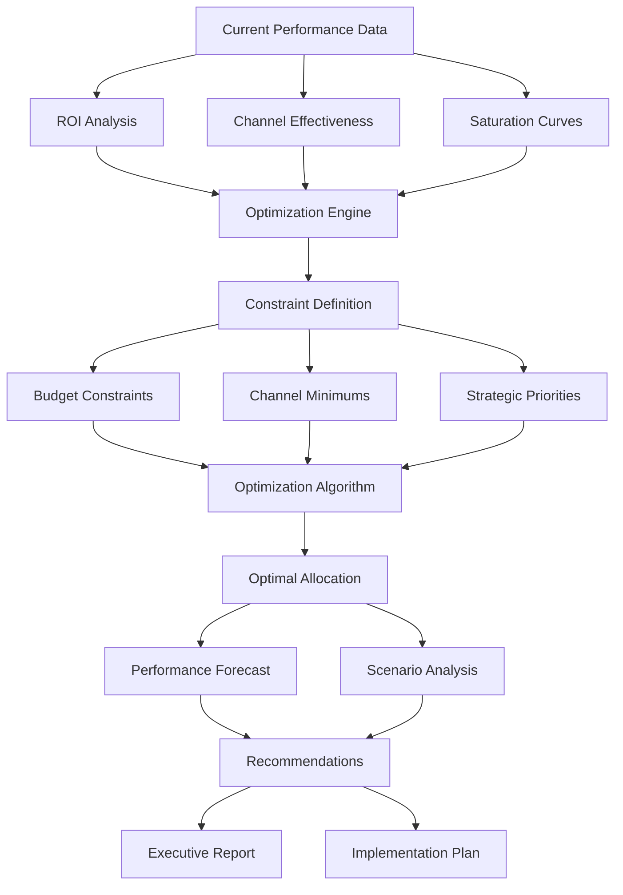
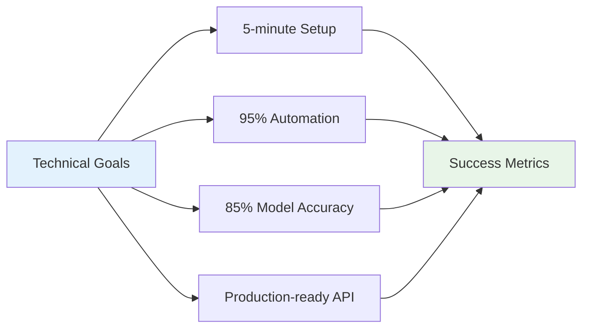
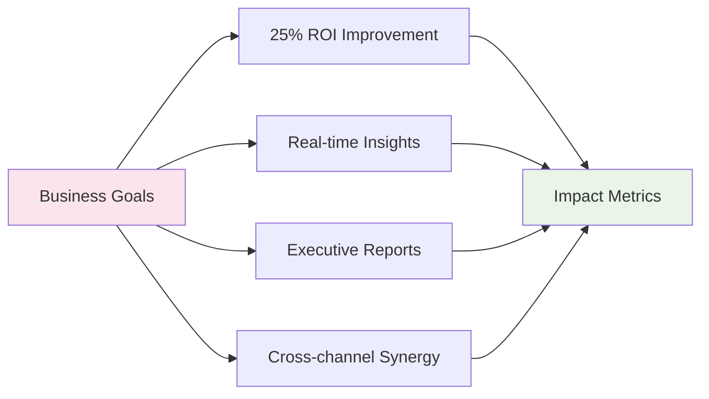
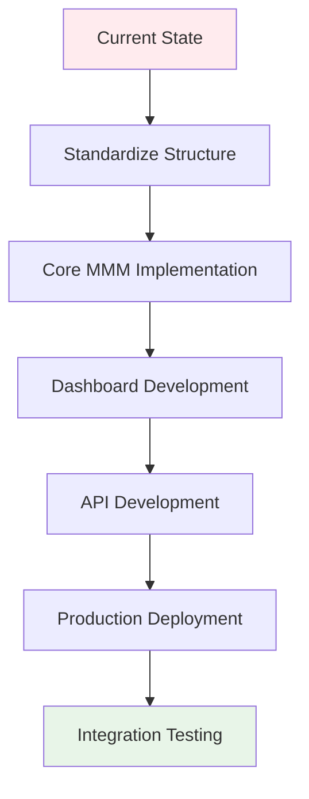

# 📊 Media Mix Modeling Platform - Project Manifest

**Advanced Marketing Attribution & Budget Optimization Platform with AI-Driven Insights**

## 🎯 Project Vision

Revolutionary Media Mix Modeling platform that combines econometric modeling, statistical attribution analysis, and AI-driven budget optimization to maximize marketing ROI. Provides real-time insights, cross-channel synergy analysis, and automated recommendations for marketing teams.

## 🏗️ Architecture Overview

### **Marketing Intelligence System Design**



### **Data Flow Architecture**



## 🚀 Technology Stack

### **Core Analytics & Statistics**
- **🐍 Python 3.8+** - Core platform development
- **🐼 Pandas** - Data manipulation and time series analysis
- **🔢 NumPy** - Numerical computing and matrix operations
- **📊 SciPy** - Statistical computing and optimization
- **📈 Statsmodels** - Econometric and time series modeling
- **🎯 Scikit-learn** - Machine learning and preprocessing
- **📉 Matplotlib/Seaborn/Plotly** - Advanced data visualization

### **Marketing & Attribution**
- **📊 Google Ads API** - Search and display campaign data
- **📱 Facebook Business SDK** - Social media advertising data
- **📈 Google Analytics API** - Website and conversion tracking
- **🏪 Salesforce API** - CRM and customer journey data
- **📧 HubSpot API** - Marketing automation and lead tracking

### **Econometric Modeling**
- **🔬 PyMC3/PyMC4** - Bayesian statistical modeling
- **📊 ArviZ** - Bayesian model diagnostics and visualization
- **🎲 Stan (PyStan)** - Advanced statistical modeling
- **🔍 Optuna** - Hyperparameter optimization for models
- **⚡ CasualImpact** - Causal inference and incrementality testing

### **Optimization & Operations Research**
- **🎯 CVXPY** - Convex optimization for budget allocation
- **🔧 PuLP** - Linear programming and optimization
- **📊 OR-Tools** - Google's optimization tools
- **⚖️ SciPy.optimize** - Non-linear optimization algorithms

### **Data Integration & ETL**
- **🔄 dbt (Data Build Tool)** - Modern data transformation
- **☁️ Apache Airflow** - Workflow orchestration and scheduling
- **📦 SQLite/PostgreSQL** - Data storage and management
- **🚀 FastAPI** - REST API for data ingestion and serving

### **Cloud & Deployment**
- **☁️ AWS SageMaker** - Model training and deployment
- **📊 Amazon S3** - Data lake and model storage
- **🐳 Docker** - Containerization for reproducible environments
- **🎨 Streamlit** - Interactive web dashboard

## 📋 Implementation Phases



## 🎯 Core MMM Components

### **Attribution Engine Architecture**



### **Budget Optimization Workflow**



## 📊 Performance Metrics & KPIs

### **Attribution Accuracy**
- **Model Validation**: R² > 0.80 for media mix models
- **Attribution Precision**: 90%+ accuracy in channel contribution
- **Incrementality Testing**: Statistical significance at 95% confidence level

### **Optimization Performance**
- **ROI Improvement**: Target 25% improvement in marketing ROI
- **Budget Efficiency**: 20% reduction in cost per acquisition
- **Allocation Accuracy**: <5% variance from optimal allocation

### **Business Impact**
- **Decision Speed**: <24 hours from data to actionable insights
- **Forecast Accuracy**: 85%+ accuracy in performance predictions
- **User Adoption**: Executive-ready reports and recommendations

## 🗂️ Gold Standard Folder Structure

```
portfolio-media-mix-modeling/
├── PROJECT_MANIFEST.md            # 📋 This comprehensive project blueprint
├── quick_start.py                 # 🚀 5-minute MMM demo
├── requirements.txt               # 📦 Core dependencies
├── pyproject.toml                # 📋 Package configuration
├── pytest.ini                   # 🧪 Test configuration
│
├── api/                          # ⚡ FastAPI REST endpoints
│   ├── main.py                   # FastAPI application
│   ├── routers/                  # API route handlers
│   │   ├── attribution.py        # Attribution analysis endpoints
│   │   ├── optimization.py       # Budget optimization endpoints
│   │   ├── performance.py        # Performance tracking endpoints
│   │   └── health.py            # Health check endpoints
│   ├── models/                   # Request/response models
│   │   ├── request_models.py     # API request schemas
│   │   └── response_models.py    # API response schemas
│   └── middleware/               # API middleware
│       ├── error_handling.py     # Error handling middleware
│       └── rate_limiting.py      # Rate limiting middleware
│
├── src/                          # 🔧 Core MMM logic
│   ├── __init__.py
│   ├── attribution/              # Attribution modeling
│   │   ├── __init__.py
│   │   ├── attribution_engine.py # Multi-touch attribution
│   │   └── attribution_analyzer.py # Statistical analysis
│   ├── optimization/             # Budget optimization
│   │   ├── __init__.py
│   │   └── budget_optimizer.py   # ROI-driven allocation
│   ├── reports/                  # Business reporting
│   │   ├── __init__.py
│   │   └── executive_reporter.py # Executive insights
│   ├── dbt_integration/          # Modern data transformation
│   │   ├── __init__.py
│   │   ├── dbt_integration.py    # dbt workflow integration
│   │   └── dbt_runner.py         # dbt execution engine
│   └── mlflow_integration.py     # Experiment tracking
│
├── data/                         # 📊 Data organization
│   ├── __init__.py
│   ├── raw/                      # Original marketing data
│   ├── processed/                # Cleaned, transformed data
│   ├── samples/                  # Demo datasets
│   │   ├── campaign_budget_data.csv
│   │   ├── channel_performance_data.csv
│   │   ├── customer_journey_data.csv
│   │   ├── marketing_campaign_data.csv
│   │   └── mmm_time_series_data.csv
│   ├── synthetic/                # Generated synthetic data
│   │   ├── __init__.py
│   │   └── campaign_data_generator.py
│   └── schemas/                  # Data validation schemas
│       ├── campaign_budget_schema.json
│       ├── channel_performance_schema.json
│       ├── customer_journey_schema.json
│       ├── marketing_campaign_schema.json
│       └── mmm_time_series_schema.json
│
├── models/                       # 🧠 MMM model implementations
│   ├── __init__.py
│   ├── mmm/                      # Media mix models
│   │   ├── __init__.py
│   │   ├── attribution_models.py # Attribution algorithms
│   │   ├── budget_optimizer.py   # Optimization models
│   │   └── econometric_mmm.py    # Bayesian MMM
│   └── r_integration/            # R model integration
│       ├── __init__.py
│       └── r_mmm_models.py       # R-based MMM models
│
├── examples/                     # 📚 Working examples
│   ├── __init__.py
│   ├── basic_examples/           # Simple use cases
│   │   ├── __init__.py
│   │   ├── simple_attribution.py
│   │   └── budget_optimizer.py
│   ├── advanced_examples/        # Complex scenarios
│   │   ├── __init__.py
│   │   └── cross_channel_synergy.py
│   └── integration_examples/     # Real-world integrations
│
├── tests/                        # 🧪 Comprehensive testing
│   ├── __init__.py
│   ├── conftest.py              # Pytest shared fixtures
│   ├── unit/                    # Unit tests
│   │   └── test_api_endpoints.py
│   ├── integration/             # Integration tests
│   │   └── test_end_to_end_mmm.py
│   ├── e2e/                     # End-to-end tests
│   │   └── test_quick_start_workflow.py
│   └── performance/             # Performance tests
│       └── test_system_performance.py
│
├── scripts/                     # 🔧 Utility scripts
│   ├── production_server.py     # Production server setup
│   ├── run_tests.py            # Test execution
│   └── setup_r_integration.py  # R integration setup
│
├── docker/                      # 🐳 Containerization
│   ├── Dockerfile              # Production container
│   ├── Dockerfile.dev          # Development container
│   ├── docker-compose.yml      # Multi-service orchestration
│   └── docker-compose.dev.yml  # Development environment
│
├── infrastructure/              # ☁️ Deployment & orchestration
│   ├── aws/                     # AWS deployment configs
│   │   ├── deploy_mmm_model.py
│   │   ├── deploy_to_aws.py
│   │   └── sagemaker_deployment.py
│   ├── dbt/                     # dbt configurations
│   │   ├── dbt_project.yml
│   │   └── profiles.yml
│   ├── airflow/                 # Airflow DAGs and configs
│   │   └── airflow.cfg
│   ├── monitoring/              # Performance monitoring
│   └── streamlit/               # Streamlit dashboard
│       ├── app.py
│       └── requirements.txt
│
├── docs/                        # 📚 Documentation
│   ├── api_reference.md         # Complete API documentation
│   ├── architecture.md          # System architecture
│   ├── deployment_guide.md      # Deployment instructions
│   ├── business_applications.md # Business use cases
│   ├── mmm_components.md        # MMM methodology
│   ├── troubleshooting.md       # Common issues and solutions
│   ├── examples_guide.md        # Example walkthroughs
│   └── docker.md               # Container documentation
│
└── outputs/                     # 📈 Generated results (gitignored)
    ├── mmm_executive_report_*.txt
    ├── mmm_executive_summary_*.json
    └── mmm_channel_performance_*.csv
```

## 🎯 Success Criteria

### **Technical Excellence**


### **Business Impact**


## 🚀 Next Steps



---

**This manifest serves as the blueprint for building a comprehensive Media Mix Modeling platform that revolutionizes marketing attribution and budget optimization through advanced analytics and AI-driven insights.**